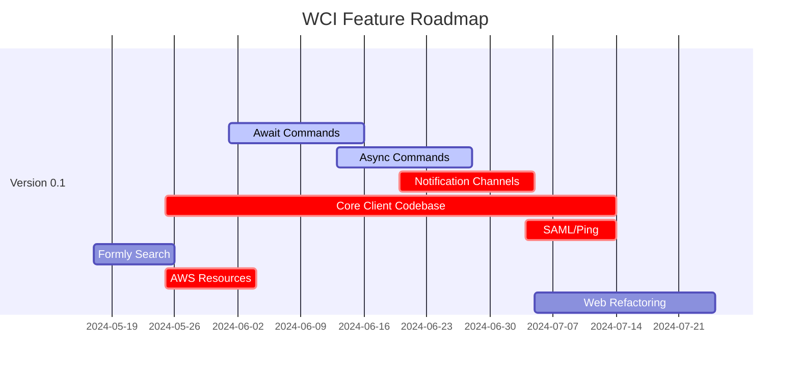
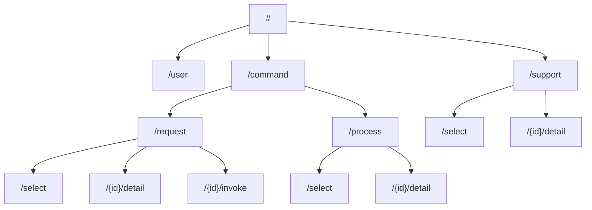
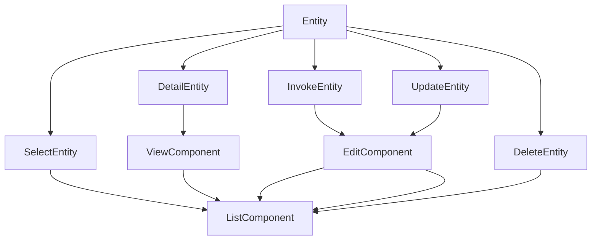

<!--suppress HtmlDeprecatedAttribute -->

<p align="center">
    
</p>

<p align="center">
    
    
    
    
</p>

---

# WCI, Web Command Interface

## Overview


Welcome to **WCI**, Web Command Interface, a generic task execution framework.

WCI is a framework intended to enable primarily back-end software engineering teams in deploying back-office applications for non-technical users without the support of front-end engineering capabilities. One of the original use-cases is converting test suites into first-class, cloud-deployed applications. These applications are intended to be deployed alongside the project(s) they are intended to test.

> [!IMPORTANT]
> TODO: More information for the overview.

## Feature Roadmap



### Item Drilldown

- Formly Search
  - Generate a Modal Dialog, or Swing-Down Dialog
  - Add the `Search` Object to the Request Properties
- Web Client Component Refactoring
  - Refactor and Split Existing Components
  - Reorganize Existing Components
- AWS Resource
  - S3 Buckets for Generated Artifacts
  - DB for Notification Persistence
  - DB for RBAC

## Conventions

TODO: More information about conventions.

### Commands

Commands comprise the core of all interactivity with a given deployed WCI project instance. Commands represent arbitrary requests, executions, and the corresponding results.

There are two main base-types for all user-defined commands; "**query**" commands, and "**async**" commands.

#### Query Commands

Commands of the type "**query**" are commands that should process and return immediately. The result returned should be the output of the command.

They should be short-lived executions, including:

- Queries
- File deletion
- Simple record changes
  - Singular create / update / delete

The command-related classes for "**query**" commands are:

- `QueryCommandResult`
- `QueryCommandRequest<TResult>`
- `QueryCommandHandler<TRequest, TResult>`

#### Async Commands

Commands of the type "**async**" are commands that should invoke a background process. The result returned should be information about the initiated process.

They should be long-lived executions, including:

- Test invocations
- Task execution for system seeding
- Complex record changes
  - Batch create / update / delete

The command-related classes for "**async**" commands are:

- `AsyncCommandResult`
- `AsyncCommandRequest<TResult>`
- `AsyncCommandHandler<TRequest, TResult>`

#### Prefixes and Suffixes

In order to make commands immediately recognizable, certain naming conventions of prefixes and suffixes should be observed when creating user-defined commands.

##### Prefixes

The command prefixes follow the "SCUDI" pattern of select, create, update, delete, invoke; similar to "CRUD", as in, create, read, update, delete.

| Prefix   | Intent                                                                                                                         | Idempotent | Async/Query        |
|----------|--------------------------------------------------------------------------------------------------------------------------------|------------|--------------------|
| `Select` | For "read" operations. Analogous to an HTTP `GET` request, or SQL `SELECT` statement.                                          | 🟢 Yes     | Probably `query`   |
| `Create` | For "write" operations that create a resource. Analogous to an HTTP `POST` request, or `INSERT` statement.                     | 🟢 Yes     | Probably `query`   |
| `Update` | For "write" operations that update a resource. Analogous to an HTTP `PUT`/`PATCH` request, or SQL `UPDATE`/`UPSERT` statement. | 🟡 Maybe   | Probably `query`   |
| `Delete` | For "write" operations that delete a resource. Analogous to an HTTP `DELETE` request, or SQL `DELETE` statement                | 🟢 Yes     | Probably `query`   |
| `Invoke` | For "execution" operations that invoke a long-lived task or processor.                                                         | 🔴 No      | Definitely `async` |

> [!NOTE]
> Yes, they're all 6 characters for a reason, because that's a good reason.

##### Suffixes

The defined framework classes of `CommandResult`, `CommandRequest`, and `CommandHandler` are not intended to be used directly. Instead, the applicable "**query**" or "**async**" base types should be implemented when creating user-defined command classes.

In the case of "**query**", the classes are:

- `QueryCommandResult`
- `QueryCommandRequest`
- `QueryCommandHandler`

In the case of "**async**" the classes are:

- `AsyncCommandResult`
- `AsyncCommandRequest`
- `AsyncCommandHandler`

These full suffixes should be incorporated into the class naming strategy for all user-defined command classes.

| Suffix   | Intent                                                                                                                                   | Returns                                      |
|----------|------------------------------------------------------------------------------------------------------------------------------------------|----------------------------------------------|
| `Query*` | For commands that return immediately, such as data queries, single resource creation functions, etc.                                     | The resulting data, implementation specific. |
| `Async*` | For commands that start a long-lived process or thread, such as test invocations, complex batchh create / update / delete processes, etc. | A descriptor of the started process.         |

> [!NOTE]
> These might not be the most *correct* names, but they describe intent accurately enough for the purpose of this framework. Please feel free to propose alternatives.

> [!NOTE]
> Doesn't that mean the names will be pretty darn long?
>
> **Yes. It's Java after all, right? Home of the `NodeFactoryBuilderFactoryFactoryBuilder`.**

#### Inheritance and Naming

##### `*CommandResult`

- Should follow the convention of `<name>[Async|Query]CommandResult`. For example, `SelectUserQueryCommandResult`.
- Must implement `[Async|Query]CommandResult`.
    - For example `SelectUserQueryCommandResult : QueryCommandResult`

##### `*CommandRequest`

- Should follow the convention of `<name>[Async|Query]CommandRequest`. For example, `SelectUserQueryCommandRequest`.
- Must implement `[Async|Query]CommandRequest` with the appropriate type parameters.
    - For example, `SelectUserCommandRequest : CommandRequest<SelectUserCommandResult>`.

##### `*CommandHandler`

- Should follow the convention of `<name>[Async|Query]CommandHandler`. For example, `SelectUserQueryCommandHandler`.
- Must implement `[Async|Query]CommandHandler` with the appropriate type parameters.
    - For example, `SelectUserQueryCommandHandler : CommandExecutor<SelectUserQueryCommandRequest, SelectUserQueryCommandResult>`

## Development Notes

> [!IMPORTANT]
> The `wci-web` project is configured to build into:
>    ```shell
>    luggsoft-wci-core-spring/src/main/resources/web
>    ``` 

> [!IMPORTANT]
> You need to build the web application first, by running
>    ```shell
>    ng build --base-href=/web/
>    ```

## Web Map



---

## Web Component Map

### `WCI-command-request-invoker`



---

# Configuration

## Common

```yaml
wci: # Root property
  TODO: # The rest
```

## Spring

```yaml
wci: # Root property
    commands: # Commands property 
    # TODO
    notifications: # Notifications property
        store:
            driver: com.luggsoft.wci.core.notifications.DefaultNotificationStore # TODO: NotificationStore type; could be memory, AWS, etc.
            params:
                ttl: 86400
```

## Deployment Architectures

### Dedicated Application

> [!IMPORTANT]
> TODO -- ECS, local, etc.

### Distributed Application

> [!IMPORTANT]
> TODO -- Lambda, Cloud Functions, etc.

#### Cloud Services, AWS

> [!IMPORTANT]
> TODO Lambda, etc.

#### Cloud Services, GCP

> [!IMPORTANT]
> TODO Cloudfunctions, etc.
