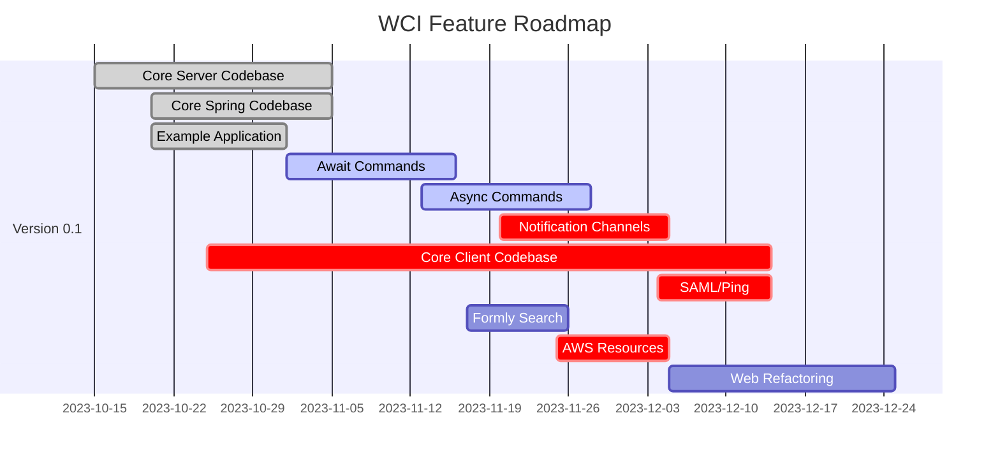
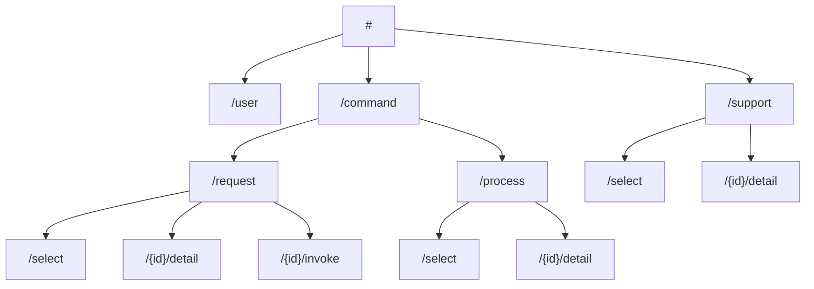
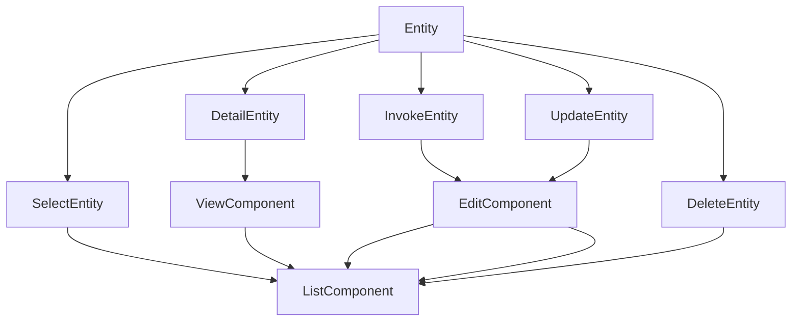

<!--suppress HtmlDeprecatedAttribute -->

<p align="center">
    
</p>

<p align="center">
    
    
    
    
</p>

---

# WCI, Web Command Interface

## Overview


**Luggsoft, WCI**, otherwise known as, the  **Web Command Interface**, is a task execution framework. One of the key use-cases is converting test suites into first-class, AWS-deployed applications. These applications are intended to be deployed alongside the project(s) they are intended to test.

TODO: More information for the overview.

> 🤔 **Q** &ndash; TODO Question.
>
> 😊 **Q** &ndash; TODO Answer.

## Feature Roadmap



### Item Drilldown

- Formly Search
  - Generate a Modal Dialog, or Swing-Down Dialog
  - Add the `Search` Object to the Request Properties
- Web Client Component Refactoring
  - Refactor and Split Existing Components
  - Reorganize Existing Components
- AWS Resource
  - S3 Buckets for Generated Artifacts
  - DB for Notification Persistence
  - DB for RBAC

## Conventions

TODO: More information about conventions.

### Commands

Commands comprise the core of all interactivity with a given deployed WCI project instance. Commands represent arbitrary requests, executions, and the corresponding results.

There are two main base-types for all user-defined commands; "**await**" commands, and "**async**" commands.

#### Await Commands

Commands of the type "**await**" are commands that should process and return immediately. The result returned should be the output of the command.

They should be short-lived executions, including:

- Queries
- File deletion
- Simple record changes
  - Singular create / update / delete

The command-related classes for "**await**" commands are:

- `AwaitCommandResult`
- `AwaitCommandRequest<TResult>`
- `AwaitCommandHandler<TRequest, TResult>`

#### Async Commands

Commands of the type "**async**" are commands that should invoke a background process. The result returned should be information about the initiated process.

They should be long-lived executions, including:

- Test invocations
- Task execution for system seeding
- Complex record changes
  - Batch create / update / delete

The command-related classes for "**async**" commands are:

- `AsyncCommandResult`
- `AsyncCommandRequest<TResult>`
- `AsyncCommandHandler<TRequest, TResult>`

#### Prefixes and Suffixes

In order to make commands immediately recognizable, certain naming conventions of prefixes and suffixes should be observed when creating user-defined commands.

##### Prefixes

The command prefixes follow the "SCUDI" pattern of select, create, update, delete, invoke; similar to "CRUD", as in, create, read, update, delete.

| Prefix   | Intent                                                                                                                         | Idempotent | Async/Await        |
|----------|--------------------------------------------------------------------------------------------------------------------------------|------------|--------------------|
| `Select` | For "read" operations. Analogous to an HTTP `GET` request, or SQL `SELECT` statement.                                          | 🟢 Yes     | Probably `await`   |
| `Create` | For "write" operations that create a resource. Analogous to an HTTP `POST` request, or `INSERT` statement.                     | 🟢 Yes     | Probably `await`   |
| `Update` | For "write" operations that update a resource. Analogous to an HTTP `PUT`/`PATCH` request, or SQL `UPDATE`/`UPSERT` statement. | 🟡 Maybe   | Probably `await`   |
| `Delete` | For "write" operations that delete a resource. Analogous to an HTTP `DELETE` request, or SQL `DELETE` statement                | 🟢 Yes     | Probably `await`   |
| `Invoke` | For "execution" operations that invoke a long-lived task or processor.                                                         | 🔴 No      | Definitely `async` |

> 🤓 **Editorial** &ndash; Yes, they're all 6 characters for a reason, because that's a good reason.

##### Suffixes

The defined framework classes of `CommandResult`, `WciCommandRequest`, and `CommandHandler` are not intended to be used directly. Instead, the applicable "**await**" or "**async**" base types should be implemented when creating user-defined command classes.

In the case of "**await**", the classes are:

- `AwaitCommandResult`
- `AwaitCommandRequest`
- `AwaitCommandHandler`

In the case of "**async**" the classes are:

- `AsyncCommandResult`
- `AsyncCommandRequest`
- `AsyncCommandHandler`

These full suffixes should be incorporated into the class naming strategy for all user-defined command classes.

| Suffix   | Intent                                                                                                                                   | Returns                                      |
|----------|------------------------------------------------------------------------------------------------------------------------------------------|----------------------------------------------|
| `Await*` | For commands that return immediately, such as data queries, single resource creation functions, etc.                                     | The resulting data, implementation specific. |
| `Async*` | For commands that start a long-lived process or thread, such as test invocations, complex batchh create / update / delete processes, etc. | A descriptor of the started process.         |

> 🤓 **Editorial** &ndash; These might not be the most *correct* names, but they describe intent accurately enough for the purpose of this framework. Please feel free to propose alternatives.

##### Notes

> 🤔 **Q** &ndash; Doesn't that mean the names will be pretty darn long?
>
> 😊 **A** &ndash; Yes. It's Java after all, right? Home of the `NodeFactoryBuilderFactoryFactoryBuilder`.

> 🤔 **Q** &ndash; TODO Question.
>
> 😊 **Q** &ndash; TODO Answer.

#### Inheritance and Naming

##### `*CommandResult`

- Should follow the convention of `<name>[Async|Await]CommandResult`. For example, `SelectUserAwaitCommandResult`.
- Must implement `[Async|Await]CommandResult`.
    - For example `SelectUserAwaitCommandResult : AwaitCommandResult`

##### `*WciCommandRequest`

- Should follow the convention of `<name>[Async|Await]WciCommandRequest`. For example, `SelectUserAwaitCommandRequest`.
- Must implement `[Async|Await]WciCommandRequest` with the appropriate type parameters.
    - For example, `SelectUserCommandRequest : WciCommandRequest<SelectUserCommandResult>`.

##### `*CommandHandler`

- Should follow the convention of `<name>[Async|Await]CommandHandler`. For example, `SelectUserAwaitCommandHandler`.
- Must implement `[Async|Await]CommandHandler` with the appropriate type parameters.
    - For example, `SelectUserAwaitCommandHandler : CommandExecutor<SelectUserAwaitCommandRequest, SelectUserAwaitCommandResult>`

## Development Notes

- The `wci-web` project is configured to build into:
    ```shell
    luggsoft-wci-core-spring/src/main/resources/web
    ``` 
  You need to build the web application first, by running
    ```shell
    ng build --base-href=/web/
    ```

## Web Map



---

## Web Component Map

### `WCI-command-request-invoker`



---

# Configuration

## Common

```yaml
wci: # Root property
  TODO: # The rest
```

## Spring

```yaml
wci: # Root property
    commands: # Commands property 
    # TODO
    notifications: # Notifications property
        store:
            driver: com.luggsoft.wci.core.notifications.DefaultNotificationStore # TODO: NotificationStore type; could be memory, AWS, etc.
            params:
                ttl: 86400
```
